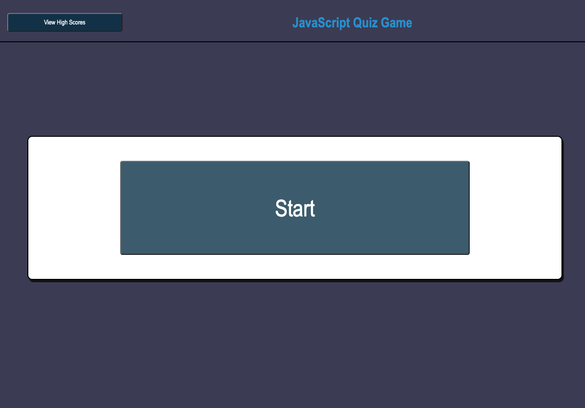
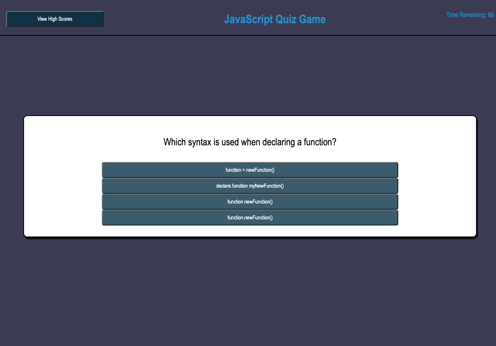
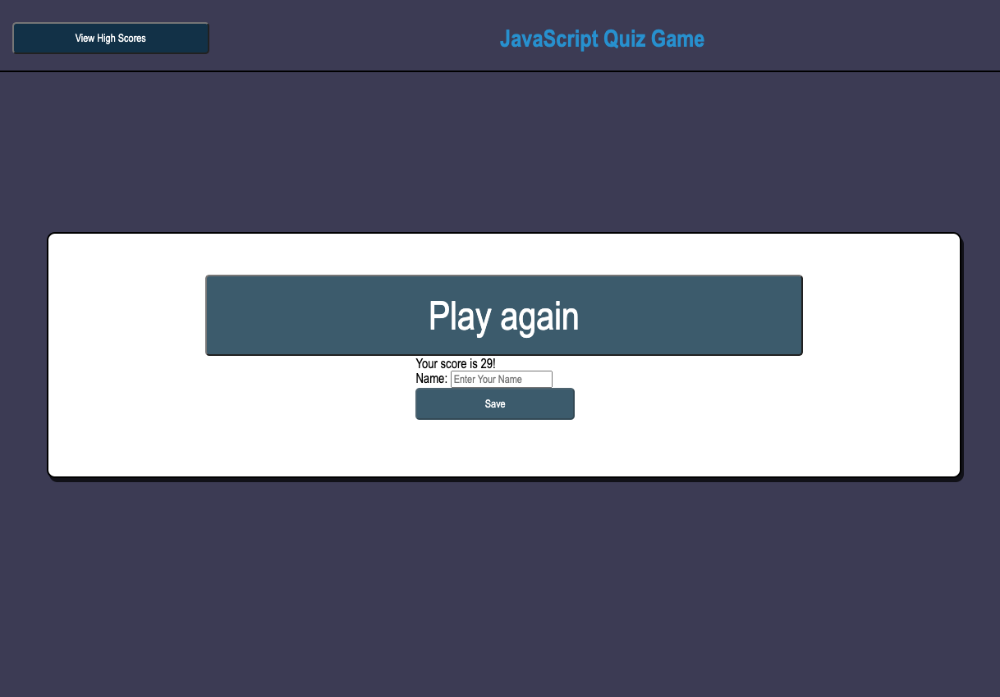

# JavaScript Quiz Game

## Purpose
This application is a game that allows the user to test their knowledge of JavaScript. 

Once the START button is clicked a question is presented.  Once an answer is selected a new question appears.  The timer begins at 75 seconds and for each wrong answer 10 seconds are subtracted.  Once the timer reaches 0 or all the questions are answered, the final score is equal to the time remaining.  

High Scores are recorded into local storage. 

## Built with
*HTML
*CSS
*JavaScript

## Website Link 

https://chrisdhodges12.github.io/quiz-game/

## Developed by Chris Hodges 